# TDM-IMG
Images du Tarot de Marseille

# Galerie des Arcanes Majeurs du Tarot

## Le Bateleur (a01)

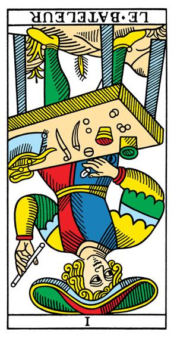

## La Papesse (a02)

## L'Impératrice (a03)

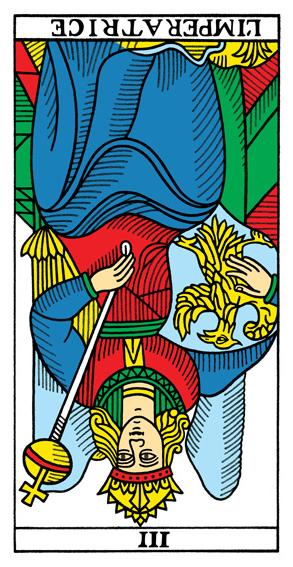

## L'Empereur (a04)

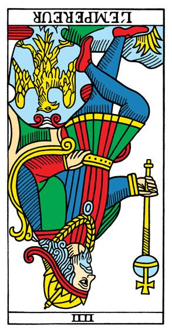

## Le Pape (a05)

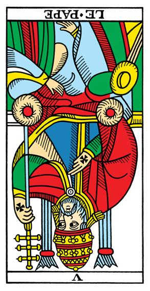

## L'Amoureux (a06)

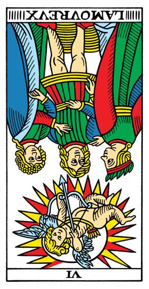

## Le Chariot (a07)

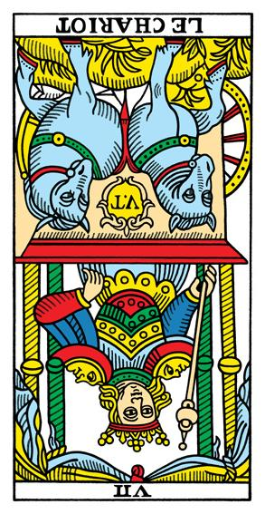

## La Justice (a08)

## L'Hermite (a09)

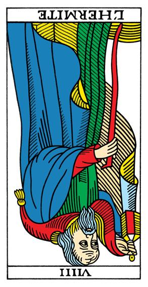

## La Roue de Fortune (a10)

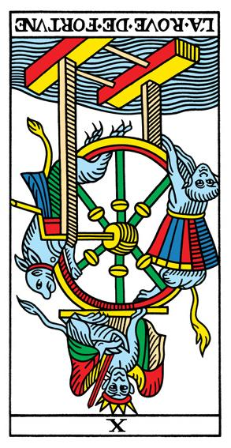

## La Force (a11)

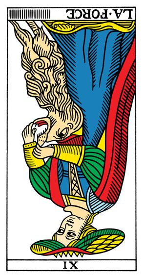

## Le Pendu (a12)

## L'Arcane sans nom (a13)

## Tempérance (a14)

## Le Diable (a15)

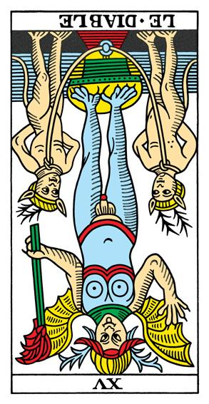

## La Maison Dieu (a16)

## L'Étoile (a17)

## La Lune (a18)

## Le Soleil (a19)

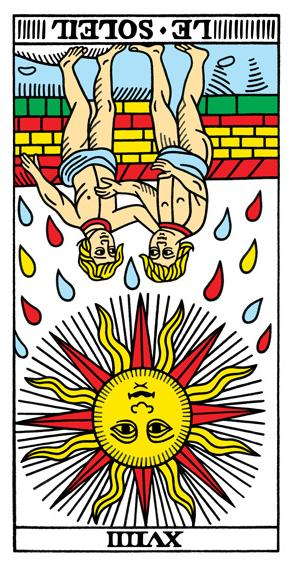

## Le Jugement (a20)

## Le Monde (a21)

## Le Mat (a22)

