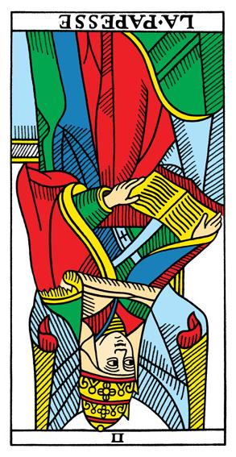
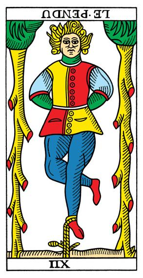
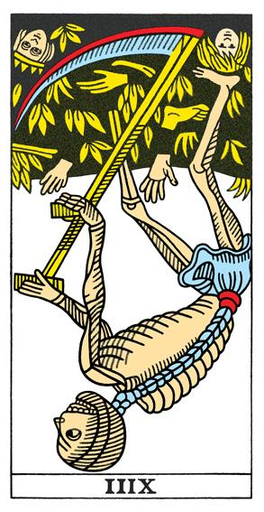
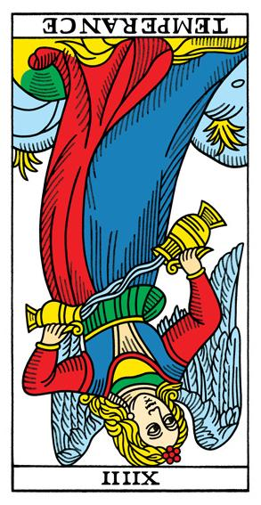
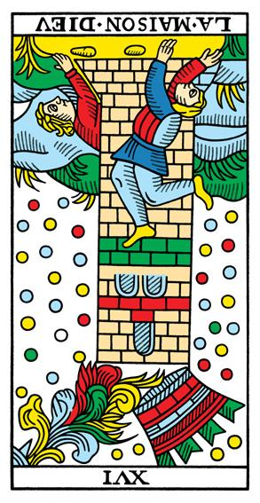
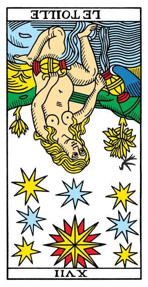
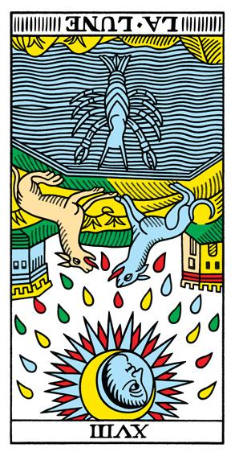
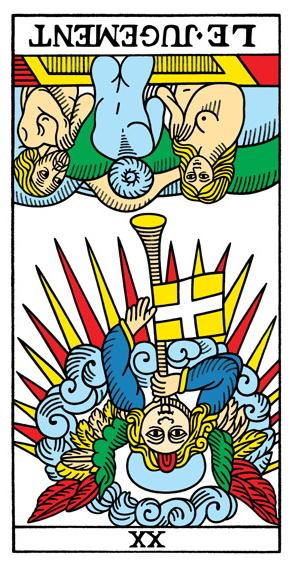
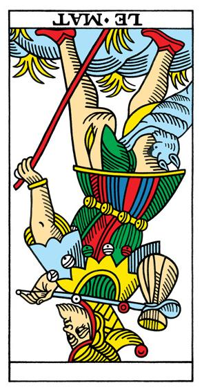

# TDM-IMG
Images du Tarot de Marseille

# Galerie des Arcanes Majeurs du Tarot

## Le Bateleur (a01)

## La Papesse (a02)

## L'Impératrice (a03)

## L'Empereur (a04)

## Le Pape (a05)

## L'Amoureux (a06)

## Le Chariot (a07)

## La Justice (a08)

## L'Hermite (a09)

## La Roue de Fortune (a10)

## La Force (a11)

## Le Pendu (a12)

## L'Arcane sans nom (a13)

## Tempérance (a14)

## Le Diable (a15)

## La Maison Dieu (a16)

## L'Étoile (a17)

## La Lune (a18)

## Le Soleil (a19)

## Le Jugement (a20)

## Le Monde (a21)

## Le Mat (a22)

